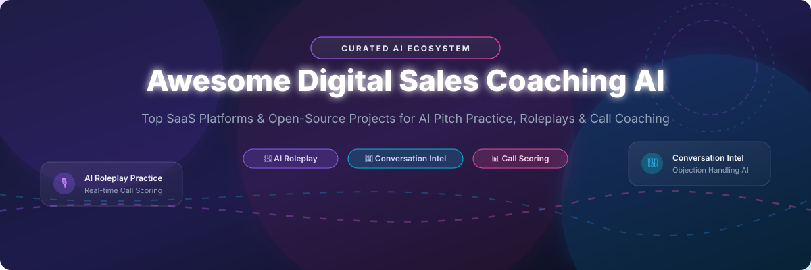

# 🤖 Awesome Digital Sales Coaching AI 🚀

 

> **A curated ecosystem of SaaS platforms and open-source GitHub projects for Digital Sales Coaching AI.**  
> *Empowering revenue leaders, enablement managers, and sales reps with AI roleplay practice, real-time call coaching, objection handling, pitch scoring, and speech analysis.*

---

## 📌 Table of Contents
- [✨ Overview](#-overview)
- [🏢 SaaS & Hosted Platforms](#-saas--hosted-platforms)
- [💻 Open-Source GitHub Repositories](#-open-source-github-repositories)
- [🤝 How to Contribute](#-how-to-contribute)
- [📈 Star History](#-star-history)
- [💖 Support & Sponsorship](#-support--sponsorship)
- [⚠️ Disclaimer](#%EF%B8%8F-disclaimer)

---

## ✨ Overview

**Digital Sales Coaching AI** transforms revenue team performance by combining conversational AI, real-time speech recognition (STT), large language models (LLMs), and automated analytics. These systems enable sales representatives to practice high-stakes discovery, pitch delivery, and objection sparring in risk-free environments while supplying managers with deep call intelligence.

---

## 🏢 SaaS & Hosted Platforms

💡 **Market Intelligence Summary:**  
The global Conversation Intelligence & AI Sales Coaching market size is currently estimated at **~$5.5 Billion (growing at a CAGR of ~18.5% through 2030)**. The sector is **moderately fragmented**: enterprise conversation intelligence behemoths (e.g., Gong, Clari) dominate end-to-end deal orchestration and manager workflows, while agile, specialized roleplay SaaS platforms (e.g., Yoodli, Second Nature, Hyperbound) capture high-growth niches in automated rep enablement and pitch certification.

The table below is sorted by **Valuation / Annual Revenue Scale (Descending)**:

| Product 🏢 | Description 📝 | Pricing (Starting Tier) 💰 | Free Tier / Trial Limit 🎁 | Valuation / Revenue Scale 📊 |
| :--- | :--- | :--- | :--- | :--- |
| **[Gong](https://www.gong.io/)** 🏆 | Enterprise conversation intelligence & AI call coaching platform for revenue teams. | **~$1,300 - $1,600 / user / yr** *(+$5,000+ base platform fee)* | **No free trial** *(Sales-led demo process)* | **$7.25B Valuation** *($500M+ ARR)* |
| **[Clari Copilot](https://www.clari.com/)** 💼 | Enterprise revenue orchestration, deal risk analysis & call coaching platform. | **~$100 - $120 / user / mo** *(Billed annually + enterprise tiers)* | **No free trial** *(Enterprise demo process)* | **$2.6B Valuation** *($450M ARR)* |
| **[Yoodli](https://yoodli.ai/)** 🎤 | AI speech & sales conversation coach providing feedback on pacing, filler words & pitch. | **$8 / user / mo** *(Pro plan, billed annually)* | **5 lifetime roleplays free** *(No time-based expiry)* | **$300M+ Valuation** *($7.5M ARR / $60M Funding)* |
| **[Salesken](https://salesken.ai/)** 🎯 | Real-time AI call assistant surfacing live objection prompts and deal insights. | **~$49 / user / mo** *(Recorded seat license + platform fee)* | **7-day demo / trial** *(Upon sales inquiry)* | **$88M Valuation** *($17.9M ARR)* |
| **[Second Nature AI](https://secondnature.ai/)** 🤖 | Conversational AI buyer roleplay & rep skill certification platform. | **~$65 / user / mo** *(Custom quote-based enterprise plan)* | **No self-serve trial** *(Interactive demo on request)* | **$37.5M Funding** *(~$15.8M ARR)* |
| **[Avoma](https://www.avoma.com/)** ⚡ | AI meeting assistant, transcript scoring & conversation intelligence suite. | **$19 / user / mo** *(AI Meeting Assistant tier, billed annually)* | **14-day free trial** *(All features included, no CC)* | **$15M Series A** *(~$15M ARR)* |
| **[Hyperbound](https://hyperbound.ai/)** 🚀 | Simulated AI buyer persona roleplays for AE & SDR pitch practice. | **~$39 / user / mo** *(Practice & Perform tiers)* | **Free tier available** *(45 prebuilt AI roleplays)* | **$15.5M Series A** *(~$3.2M ARR)* |
| **[Quantified AI](https://quantified.ai/)** 🧠 | Enterprise AI roleplay simulator tailored for regulated sales sectors (Finance/Pharma). | **~$85 / user / mo** *(Enterprise quote-based tier)* | **No free trial** *(Sandbox demo upon request)* | **Venture-Backed** *(~$3M ARR)* |
| **[MeetRecord (Outdoo)](https://meetrecord.com/)** 📊 | Call recording, coaching scorecard automation & roleplay practice stack. | **$19 / user / mo** *(Standard call coaching plan)* | **Free plan available** *(60 mins call coaching credits)* | **$2.7M Pre-Series A** *(~$2.9M ARR)* |
| **[PitchMonster](https://pitchmonster.io/)** 🥊 | Multimodal AI roleplay platform for video, audio, and presentation pitch practice. | **~$25 / user / mo** *(Volume-discounted per-seat tier)* | **Free plan available** *(Roleplay sandbox environment)* | **Seed / Bootstrap** *(~$1M ARR)* |

---

## 💻 Open-Source GitHub Repositories

Explore production-grade open-source speech models, conversational frameworks, multi-agent roleplay simulators, and local sales coaches.

The list below is sorted by **GitHub Stars_Count (Descending)**:

| Repository 📦 | Stars_Count ⭐ | Description & Key Features 🚀 |
| :--- | :--- | :--- |
| **[OpenAI Whisper](https://github.com/openai/whisper)** 🔊 |  | General-purpose speech recognition model powering state-of-the-art STT pipelines for local call transcription and coaching scoring engines. |
| **[Rasa](https://github.com/RasaHQ/rasa)** 💬 |  | Open-source conversational AI framework adaptable to structured buyer roleplays, objection decision trees, and sales practice bots. |
| **[Pipecat AI](https://github.com/pipecat-ai/pipecat)** 🐱 |  | Open-source framework for building real-time voice, multimodal, and conversational sales coaching agents with low latency. |
| **[LiveKit Agents](https://github.com/livekit/agents)** 🎙️ |  | Real-time voice AI agent framework ideal for sub-second audio sales call roleplay and instant spoken feedback. |
| **[AWS Sample AI Sales Roleplay](https://github.com/aws-samples/sample-ai-sales-roleplay)** ☁️ |  | Cloud reference architecture for voice dialogue sales roleplay with automated session analytics and performance scoring reports. |
| **[OpenCloser](https://github.com/issacops/opencloser-v2)** 🛡️ |  | Local multi-agent AI sales platform featuring strategist, voice caller, objection sparring, and post-call debrief agents. |
| **[Sales Call Analyzer](https://github.com/Paddychief92/sales-call-analyzer)** 🔍 |  | AI-powered sales call analysis tool using LLMs to provide feedback on objection handling, discovery questions, and closing tactics. |
| **[SalesEye](https://github.com/cphizz/SalesEye)** 👓 |  | Real-time AI sales coach that listens to live calls, detects buyer objections, and displays live cues on smart glasses or screens. |
| **[My Sales Coach](https://github.com/the-swedish-one/my-sales-coach)** 🗣️ |  | React/Node sales practice chatbot equipped with speech recognition and synthesis for pre-set scenario training. |
| **[Saleschat](https://github.com/redbuilding/saleschat)** 🎯 |  | Python app for practicing sales pitches with AI prospects (powered by Llama via Ollama/Groq) with real-time coach scoring. |
| **[Sales Practice Agent](https://github.com/Jaskey15/sales-practice-agent)** 📞 |  | Two-agent system combining an AI prospect persona with a feedback coach agent for telephone and voice sales practice. |

---

## 🤝 How to Contribute

Contributions are warmly welcome! Help us keep this repository comprehensive and up to date.

1. 🍴 **Fork** the repository.
2. 🌿 Create a new feature branch (`git checkout -b feature/add-new-tool`).
3. ✏️ Add or update entries in `README.md` following the tabular format.
4. 🔍 Ensure descriptions are objective and include verifiable pricing/valuation or Stars_Counts.
5. 🚀 Submit a **Pull Request** with a concise summary of changes.

Please review our awesome list guidelines at [Awesome-Awesome-Awesome](https://github.com/ishandutta2007/Awesome-Awesome-Awesome).

---

## 📈 Star History

---

## 💖 Support & Sponsorship

Thank you for visiting **Awesome Digital Sales Coaching AI**! 🌟  
If you find this repository helpful for your research, team training, or project building, please consider:
- ⭐ **Starring** the repository on GitHub
- 🍴 **Forking** it to share with your peers
- 📢 **Sharing** it on LinkedIn, Twitter/X, and sales enablement communities

☕ **Sponsor & Buy a Coffee:**  
If you'd like to support the ongoing maintenance of this awesome list, consider sponsoring via [GitHub Sponsors](https://github.com/sponsors/ishandutta2007).

---

## ⚠️ Disclaimer

- This list is **community-curated** for educational and research purposes.
- Valuation, pricing, and revenue figures for SaaS providers represent third-party market estimates and public disclosures. Always verify current pricing directly with vendor sales representatives.
- Handle call recordings and speech analytics in strict accordance with local legal consent, GDPR/CCPA retention rules, and enterprise data privacy policies.
